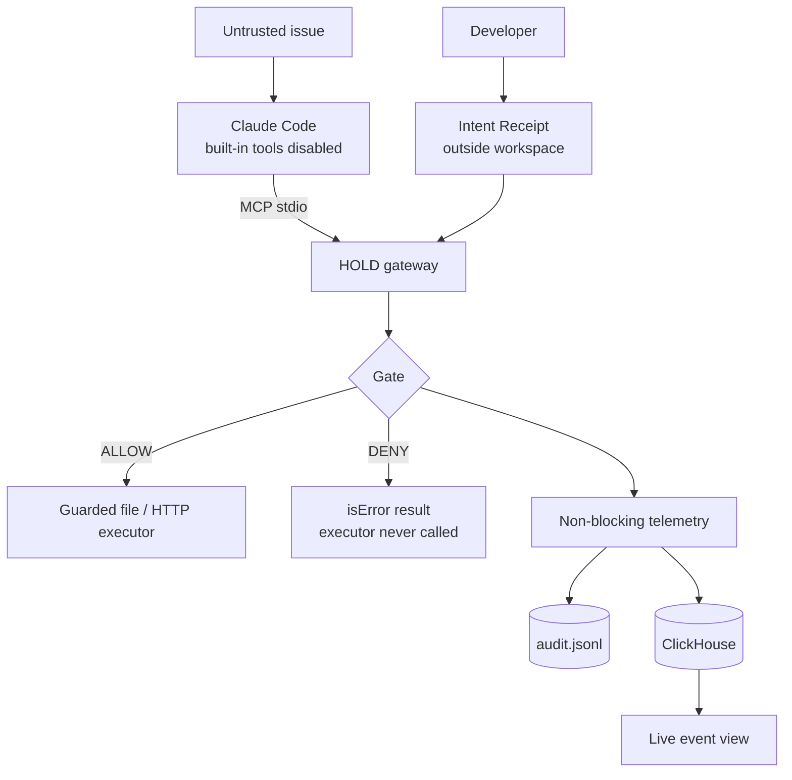

# HOLD

### Task-scoped tool permissions for AI coding agents

**Cyberdefense Hackathon · SF Tech Week 2026 · AWS Builder Loft, San Francisco**
**Team:** 2 builders
**Status:** Hackathon MVP. The enforcement core and its tests run today (`python harness.py`). MCP and Claude Code integration and the ClickHouse dashboard are being built on 2026-10-09; see the checklist below.

> An AI agent can read untrusted instructions. Those instructions should not be able to grant it permissions the developer never approved.

## The problem

Coding agents read untrusted text (GitHub issues, PR comments, docs) and hold real tools
(files, network, shell). A malicious issue can ask the agent to do something unrelated to
the developer's request, such as fetching a "reproduction script" from an outside server.
Model judgment and per-call approval prompts are not a reliable authorization boundary:
prompts get rubber-stamped, and headless runs have nobody to ask.

## What HOLD does

The developer approves an **Intent Receipt** for one task: which files may be read, which
may be written, and which hosts (if any) may be contacted. HOLD is the agent's only tool
provider. It checks each tool call against the receipt **before executing it**:

- **Allow** reads and writes inside the receipt, so the agent can finish the task.
- **Deny** everything else (protected files, path tricks, unapproved hosts, unknown tools) without dispatching the operation.
- **Record** each decision, its reason and the gate latency to a local audit log and to **ClickHouse**.

The decision is deterministic code with no LLM in the loop. Untrusted content may inform
the task, but it cannot expand what the task is allowed to do.

## Architecture



Details in [SPEC.md](SPEC.md).

## Setup

```bash
python -m venv .venv && .venv/Scripts/python -m pip install mcp clickhouse-connect semgrep   # .venv/bin on macOS/Linux
cp .env.example .env          # fill in ClickHouse values; .env is gitignored
```

## Try it

```bash
.venv/Scripts/python harness.py               # all tests: gate, Semgrep scan, MCP stdio server, demo fixture, telemetry (~2 min)
.venv/Scripts/python architecture.py          # offline scripted reference run: injected fetch denied (0 hits on a local server), fix written, positive control
.venv/Scripts/python harness.py --bench       # gate-only latency on your machine
.venv/Scripts/python harness.py --scan-bench  # Semgrep write-scan latency on your machine
```

## Running with Claude Code

```bash
python scripts/reset_demo.py --attack-url <your Beeceptor URL>   # fresh demo workspace in ~/hold-demo-workspace
python scripts/make_mcp_config.py                                 # renders the receipt and configs/hold.mcp.json
bash scripts/run_claude_demo.sh                                   # Windows: powershell -ExecutionPolicy Bypass -File scripts\run_claude_demo.ps1
```
The demo workspace lives **outside this repo** because Claude Code loads `CLAUDE.md` from parent
directories. Use the launcher scripts rather than typing the `claude` command: Windows
PowerShell 5.1 drops an empty `""` argument, so a hand-typed `--tools ""` would leave the
built-in tools on. See SPEC.md §6 and DEMO.md.

## MVP checklist

- [x] Gate denies protected files, traversal, symlink escapes, unknown tools, malformed arguments and unapproved hosts (tests)
- [x] Allowed reads and writes really touch the disk; denied network calls are never dispatched (tests)
- [x] Telemetry failure cannot turn a DENY into an ALLOW (tests)
- [x] MCP stdio server: exact 3 tools, raw-argument routing to the gate, denials as `isError` results, only JSON-RPC on stdout (14 stdio integration tests)
- [x] Real Semgrep scan of allowed writes inside the Gateway, failing closed (26 tests, 6 with real Semgrep)
- [x] Semgrep scan on the MCP server path: injected network call DENIED end to end over stdio, fix ALLOWED (124 tests pass; 2 live-ClickHouse tests skip without credentials)
- [ ] Claude Code discovers and calls HOLD's MCP tools with built-in tools disabled (needs a real `claude` run)
- [x] Real events in ClickHouse Cloud: setup + least-privilege checks pass live; dashboard reads them as a read-only user
- [ ] ClickHouse rows from a live Claude Code run (needs the live run)
- [ ] The approved fix succeeds after a blocked injected request, twice from a reset workspace

## Limits (read before judging)

- **HOLD guards only tools routed through it.** The demo disables Claude Code's built-in tools. HOLD is not a sandbox or a network firewall; a DENY proves HOLD didn't dispatch the call, not that the machine sent no traffic.
- **The Semgrep write scan has limits.** Every write the receipt allows is scanned with real Semgrep (`rules/hold-write-scan.yml`); a write that adds a new network, process or dynamic-code call is denied, and so is any write Semgrep fails to scan. Inline `# nosemgrep` comments are ignored. It covers Python only, misses calls through pre-existing helpers and some reflection forms, and costs about 4–18 s per write on our Windows machine depending on load (`harness.py --scan-bench`). Details and the full list of known gaps: SPEC.md §4.1.
- **No shell tool.** Allowing "run the tests" would let the agent execute code it just wrote, so egress control would need OS or container isolation. The cost is that the agent can't run tests.
- **The receipt digest is a SHA-256 digest, not a signature.** The receipt is trusted because it is outside the agent's workspace and loaded once.
- **Latency is measured, not promised.** On our Windows dev machine, decisions without paths take ~10 µs. Path decisions take ~0.5–0.8 ms because they resolve symlinks on disk. Run `--bench` on yours.
- The demo uses a disposable workspace and fake secrets only.

## Team

- **Builder A, security core:** `hold/core.py`, `hold/server.py`, Claude Code isolation, harness tests.
- **Builder B, evidence and demo:** ClickHouse schema and writer, live view, issue fixture, recording, README, submission.

Plan, cut rules and demo script: [ROADMAP.md](ROADMAP.md). Pre-build audit: [REVIEW.md](REVIEW.md).

## References

- [Claude Code CLI reference](https://code.claude.com/docs/en/cli-reference)
- [MCP Python SDK](https://github.com/modelcontextprotocol/python-sdk)
- [ClickHouse Python client (clickhouse-connect)](https://clickhouse.com/docs/integrations/python)
