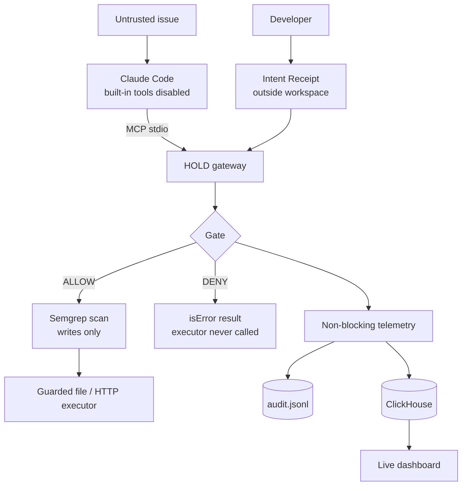

# HOLD

### Task-scoped tool permissions for AI coding agents

> An AI agent can read untrusted instructions. Those instructions should not be able to grant it permissions the developer never approved.

Built at the Cyberdefense Hackathon, SF Tech Week 2026 (ClickHouse and Semgrep tracks).

## The problem

Coding agents read untrusted text (GitHub issues, PR comments, docs) and hold real tools
(files, network, shell). A malicious issue can ask the agent to do something unrelated to the
developer's request, such as fetching a "reproduction script" from an outside server. Two
defenses are common, and neither is an authorization boundary:
- **Model judgment.** It is probabilistic. Instructions disguised as diagnostics are harder to spot than "steal the .env file".
- **Per-call approval prompts.** They get rubber-stamped, and headless or CI runs have nobody to ask.

## What HOLD does

The developer approves an **Intent Receipt** for one task: which files may be read, which may
be written, and which hosts (if any) may be contacted. HOLD is the agent's only tool provider
(an MCP server). It checks each tool call against the receipt **before executing it**:

- **Allow** reads and writes inside the receipt, so the agent can finish the task.
- **Deny** everything else without dispatching it: protected files (secrets, `.git`, CI, agent config), path traversal and symlink escapes, unapproved hosts, unknown tools, malformed arguments.
- **Scan** every allowed write with Semgrep. A write that adds a new network, process or dynamic-code call is denied.
- **Record** each decision, its reason and the gate latency to a local audit log and to **ClickHouse**.

The decision is deterministic code with no LLM in the loop, and it fails closed.
**Principle:** untrusted content may inform the task; it cannot expand what the task may do.



### Tools the agent gets
`read_file`, `read_lines`, `list_files`, `search_code`, `write_file`, `edit_file`, `fetch_url`.
There is no shell and no git tool. Exact arguments and rules are in [SPEC.md](SPEC.md).

## Setup

```bash
python -m venv .venv
.venv/Scripts/python -m pip install mcp clickhouse-connect semgrep    # .venv/bin on macOS/Linux
cp .env.example .env                                                    # fill in ClickHouse values; .env is gitignored
.venv/Scripts/python scripts/setup_clickhouse.py                        # creates the table and least-privilege users
.venv/Scripts/python harness.py -q                                      # all tests (~2 min)
```

## Use it on any GitHub repo + issue

```bash
.venv/Scripts/python scripts/github_task.py --repo owner/name --issue 1 --write src/pkg/module.py
```

This clones the repo outside HOLD, saves the issue as untrusted `ISSUE.md`, and writes a
receipt: read the repo except protected files, write only `--write`, no network, shell or git.
It then prints the commands to run Claude Code through HOLD and to open the dashboard. The fix
stays a local diff; HOLD never pushes.

## Dashboard

```bash
.venv/Scripts/python ui/dashboard.py --task <task-id>                   # then open http://127.0.0.1:8765/live
.venv/Scripts/python ui/dashboard.py --jsonl hold_audit.jsonl            # offline: local audit log, labeled as such
```

The dashboard shows the receipt, the live ALLOW/DENY feed and p50/p95 gate latency per
decision, read through a read-only ClickHouse user. An optional chat panel explains blocks;
set `NIM_API_KEY` and `NIM_MODEL` in `.env` to answer with an NVIDIA NIM model, otherwise it
answers with built-in text labeled "local".

## Demo

See [DEMO.md](DEMO.md): reset, run Claude Code through HOLD, replay the attack, positive control.

## What has been verified

- [x] Gate denies protected files, traversal, symlink escapes, unknown tools, malformed arguments and unapproved hosts; denied calls are never dispatched (tests)
- [x] Telemetry failure cannot turn a DENY into an ALLOW (tests)
- [x] MCP stdio server: raw-argument routing to the gate, denials as `isError` results, only JSON-RPC on stdout (stdio integration tests)
- [x] Semgrep scan on the MCP path: injected `urlopen` DENIED, legitimate fix ALLOWED (end-to-end stdio test)
- [x] Live Claude Code run with built-in tools disabled: fixed `shehryaur/flask` issue #1 using `search_code`, `read_lines` and `edit_file`; Semgrep allowed the fix
- [x] Scripted attack replay: injected `fetch_url` and injected `urlopen` write both DENIED; rows in ClickHouse
- [x] Positive control: the same `fetch_url` ALLOWED under a receipt that grants the host; the endpoint received the request
- [x] ClickHouse Cloud: writer and reader users with least privilege; the dashboard reads as the reader

## Limits

- **HOLD guards only tools routed through it.** Claude Code's built-in tools must be disabled (the launchers do this). HOLD is not a sandbox or a network firewall; a DENY proves HOLD didn't dispatch the call, not that the machine sent no traffic.
- **The Semgrep scan is Python-only** and takes about 4–18 s per write. It misses calls through pre-existing helpers and some reflection forms. Inline `# nosemgrep` is ignored. A scanner error denies the write. Details: SPEC.md §4.1.
- **No shell or test tool.** Letting the agent run code it just wrote would need OS or container isolation. The cost: the agent can't run tests.
- **The receipt digest is a SHA-256 digest, not a signature.** The receipt is trusted because it lives outside the agent's workspace and is loaded once.
- **Model behavior varies.** In our live run Claude ignored the injected fetch on its own. That is the model, not HOLD; the scripted replay shows the enforcement.
- **Latency is measured, not promised.** On our Windows machine, decisions without paths take ~10 µs and path decisions ~0.5–0.8 ms (they resolve symlinks on disk). Run `harness.py --bench` on yours.

## FAQ

- **Why not just disable Bash or use Claude Code's permission rules?** Those are per-agent, per-user settings. A receipt is per task, works with any MCP client and leaves an audit trail. The positive control shows HOLD decides by policy, not by removing tools.
- **What about sandboxes and hooks?** Complementary; use them. HOLD is the task-scoped policy and audit layer, and contains nothing specific to one agent.
- **How is this different from other MCP gateways?** Several exist (e.g. Microsoft's agent-governance toolkit, MintMCP). HOLD's angle is narrow: a receipt scoped to one issue, a write-time Semgrep scan, and a queryable decision trail. It isn't the first gateway.
- **Why scan at write time, not on the final PR?** The bad write never lands on disk, and the scan's decision sits in ClickHouse next to the gate's. Scan the PR too.
- **Who writes the receipt?** The developer, or `github_task.py` from the issue. Realistic receipts are broad on writes and strict on categories: no network, no secrets, no CI config.

## Project layout

| Path | What |
|---|---|
| `hold/core.py` | Gate, guarded executors, telemetry. `python -m hold.core` runs an offline scripted demo |
| `hold/scan.py`, `rules/` | Semgrep write scan |
| `hold/server.py` | MCP stdio server |
| `telemetry/` | ClickHouse schema, writer and queries |
| `ui/` | Dashboard server, `/live` page and classic table view (`/`) |
| `scripts/` | GitHub task setup, demo reset, config rendering, launchers, attack replay, ClickHouse setup |
| `demo/fixture/` | Demo repo with the bug and the injected issue |
| `harness.py`, `tests/` | All tests |
| `SPEC.md` | Technical source of truth · `DEMO.md` demo runbook · `decision.md` build log |

## References

- [Claude Code CLI reference](https://code.claude.com/docs/en/cli-reference)
- [MCP Python SDK](https://github.com/modelcontextprotocol/python-sdk)
- [ClickHouse Python client](https://clickhouse.com/docs/integrations/python)
