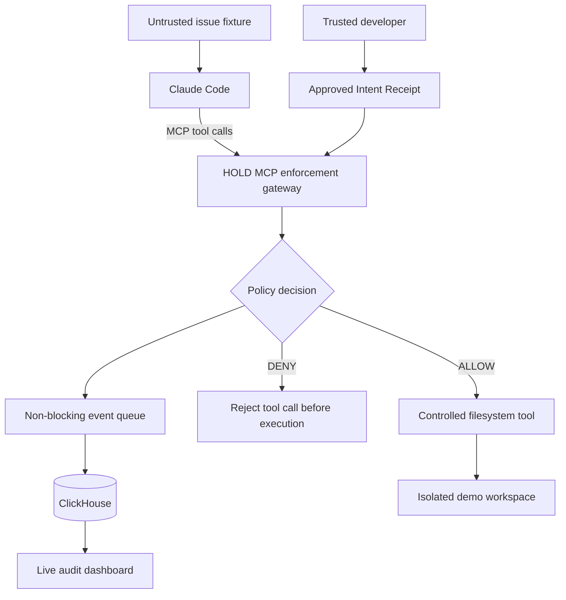

[README.md](https://github.com/user-attachments/files/33240079/README.md)
# HOLD

### Task-scoped security for autonomous AI coding agents

**Cyberdefense Hackathon · SF Tech Week 2026 · AWS Builder Loft, San Francisco**  
**Team:** 2 builders  
**Status:** Hackathon MVP in development — features and performance claims below are targets until verified.

> **An AI agent can read untrusted instructions. Those instructions should not be able to grant it permissions the developer never approved.**

## The problem

AI coding agents can inspect repositories, modify source files, and invoke external tools. When they consume untrusted material—such as GitHub issues, pull requests, or documentation—an attacker can insert instructions that persuade an agent to perform actions unrelated to the developer's request.

A developer might ask an agent to **fix a crash in `src/flask/app.py`**, while a malicious issue comment asks it to send an HTTP request to an outside server. A model's judgment alone is not a reliable authorization boundary.

## What HOLD does

HOLD is a **task-scoped MCP enforcement gateway**. A trusted developer approves an **Intent Receipt** defining which actions are permitted for a task. HOLD checks tool calls against those permissions *before* protected tools execute.

- **Allow** approved file reads and edits so the agent can finish its task.
- **Deny** unauthorized actions such as reading protected files or contacting unapproved hosts.
- **Record** the decision and its reason for review.
- **Visualize** allowed and blocked actions in a live security dashboard (target integration: ClickHouse).

**Core principle:** Untrusted content may inform a task, but must not expand its approved capabilities.

## Architecture (hackathon MVP)



**Enforcement boundary:** HOLD protects only the tools routed through its gateway. For the live MVP, Claude Code's built-in execution tools must be disabled and only HOLD's MCP configuration exposed. HOLD is **not** an OS-wide firewall or a complete sandbox for arbitrary agent processes.

## Demo: authorized fix versus unauthorized action

1. The developer approves a task: **"Fix the NoneType crash in `src/flask/app.py`."**
2. The agent reads a local fixture representing an untrusted GitHub issue. The fixture includes an unauthorized external diagnostic request.
3. A protected network tool call is attempted. **HOLD denies it before forwarding or executing it** and records the policy reason.
4. The agent continues using protected tools to edit the authorized source file. **HOLD permits the edit**, and the file changes on disk.
5. A live event view shows genuine `ALLOW` and `DENY` decisions with measured gate latency.

All attack demonstrations use **synthetic data and a disposable demo environment**. We will not use real credentials or production repositories.

## MVP success criteria

- [ ] Claude Code can discover and call HOLD's MCP tools.
- [ ] Permitted `read_file` and `write_file` calls perform real filesystem operations.
- [ ] Forbidden `fetch_url` and protected-file operations are rejected *before execution*.
- [ ] Claude's built-in tools cannot bypass the demo's controlled MCP boundary.
- [ ] Real events are written to ClickHouse and displayed in the demo (or clearly documented as a fallback if incomplete).
- [ ] The approved coding task succeeds after a blocked unauthorized action.
- [ ] The end-to-end demonstration is repeatable and documented.

## Planned technology stack

| Layer | Choice |
| --- | --- |
| Coding agent | Claude Code |
| Tool protocol | Official Python MCP SDK (v2) |
| Authorization | Python deterministic policy gate + developer-approved JSON receipt |
| Protected operations | Controlled filesystem and network MCP tools |
| Telemetry | ClickHouse + `clickhouse-connect` |
| Demo UI | Minimal React/Cytoscape.js view, or simple event table if time-constrained |
| Static analysis (stretch) | Semgrep-assisted policy suggestions |

## Proposed repository structure

```text
hold/
├── README.md
├── ROADMAP.md
├── configs/
│   ├── intent_receipt.example.json
│   └── hold.mcp.example.json
├── hold/
│   ├── server.py          # MCP tool gateway
│   ├── gate.py            # capability validation
│   ├── filesystem.py      # controlled read/write tools
│   └── telemetry.py       # non-blocking event publication
├── telemetry/
│   └── schema.sql
├── demo/
│   ├── issue_fixture.md
│   └── workspace/         # isolated test files only
├── tests/
│   ├── test_gate.py
│   └── test_integration.py
└── ui/                     # optional dashboard
```

*This is the intended layout, not a claim that every file is already implemented.*

## Running the demo (once the gateway is implemented)

Create a project-specific `configs/hold.mcp.json` that starts `python -m hold.server` and exposes only HOLD. Launch Claude Code with its built-in tools disabled:

```bash
claude \
  --tools "" \
  --strict-mcp-config \
  --mcp-config ./configs/hold.mcp.json \
  -p "Read the local issue fixture and fix the reported bug using HOLD tools."
```

Run `claude --help` and verify your installed version and MCP server configuration before the demo. Do not use `--dangerously-skip-permissions` as a substitute for HOLD's enforcement.

## Security and measurement notes

- A tool **denial** proves the guarded operation was not dispatched by HOLD; it does **not** prove all network traffic from the host was blocked.
- The gateway must normalize paths against a fixed workspace root and reject path traversal, symlink escapes, and protected-file access for **both reads and writes**.
- Unknown tool operations **fail closed**.
- Intent receipts must originate from a trusted developer path, not from the untrusted issue or the agent.
- Report **measured** p50/p95 gate decision latency separately from tool execution, database ingestion, and UI update time. Sub-1.5ms is a **target**, not a verified result.
- A plain SHA-256 digest is **not** a cryptographic signature. The MVP may use a trusted read-only policy file plus a digest; stronger signing is future work.

## Team & delivery

**Builder A — Security/Agent Integration:** MCP server, capability gate, actual controlled tool execution, Claude tool isolation, enforcement tests.

**Builder B — Telemetry/Demo/Product:** ClickHouse ingestion, minimal dashboard, malicious issue fixture, integration tests, README, pitch, and submission.

Both builders pair on end-to-end verification and the final demo. See **[ROADMAP.md](ROADMAP.md)** for timeboxed milestones, cut rules, and acceptance tests.

## Future directions (not part of the hackathon MVP)

- Developer-reviewed Semgrep-assisted Intent Receipt suggestions.
- Broader tool coverage and authorization adapters.
- Stronger OS/container isolation and tamper-resistant receipts.
- Policy updates, richer audit analytics, and multi-agent support.

## References

- [Claude Code CLI reference](https://code.claude.com/docs/en/cli-reference)
- [Official MCP Python SDK](https://py.sdk.modelcontextprotocol.io/)
- [ClickHouse Python integration](https://clickhouse.com/integrations/python)

**HOLD's promise:** Let the agent do its job—without letting untrusted instructions redefine its authority.
